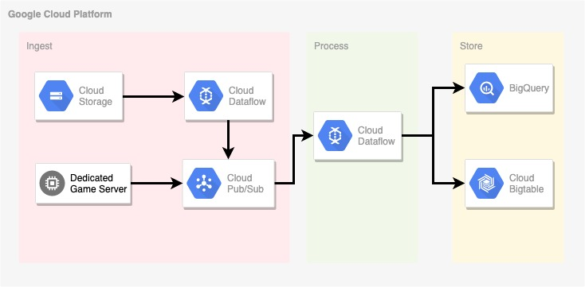
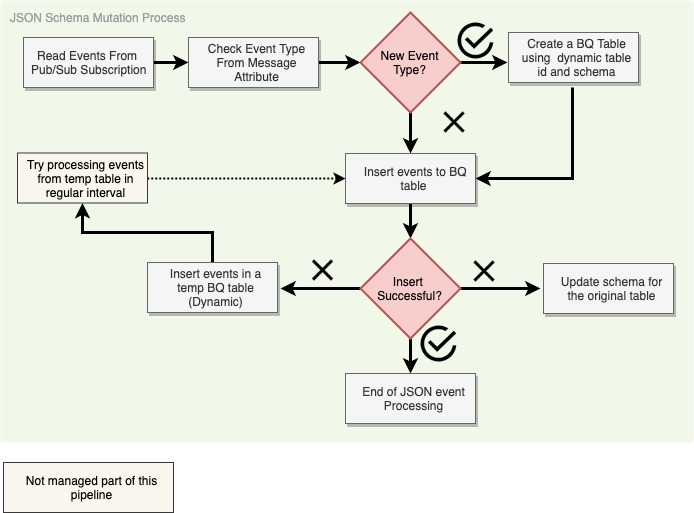
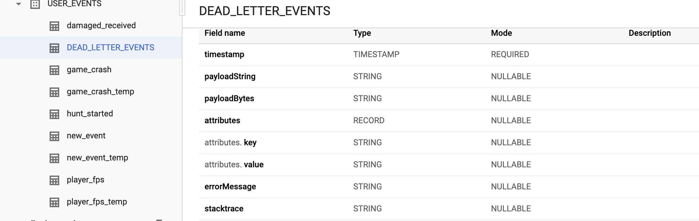
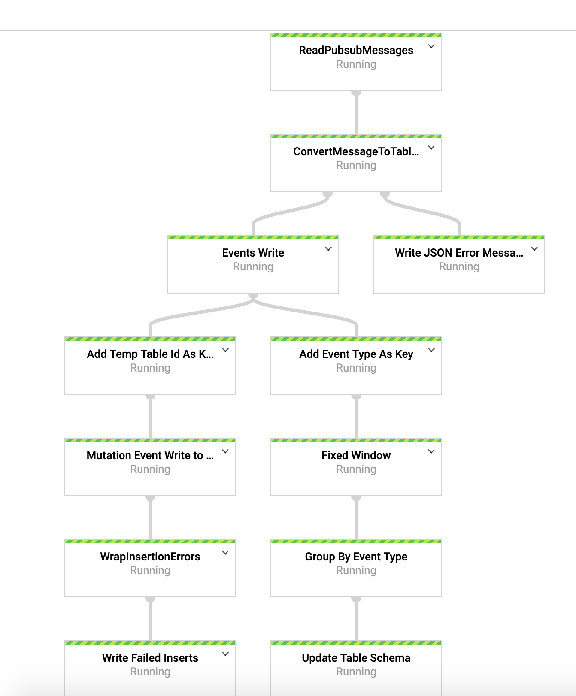

### JSON Schema Mutation PoC using Dataflow

This is a sample dataflow streaming pipeline that reads user events in JSON format from PubSub and automatically manages schema mutation and stores them in Big Query by event type. To level set for the context of this PoC, schema mutation means publishing new or updated JSON messages as an event in PubSub and manage the changes without any manual intervention in BigQuery.

### Challenges 

1. As events are published in pubsub, based one the event type, a dynamic table with schema must be created in BigQuery. 
2. For an existing event type, schema may change at any time which means process must manage handling new schemas as well as events that may contain old schemas and have not been processed.
3. There is a caching delay for Big Query schema inserts even after the schema is updated for the original table which means inserts right after schema update may fail. 
4. Record Types for nested JSON schema should be handled as well. 
5. Perform this reliably at scale (e.g. 1M events/sec)

### Design & Architecture 

This PoC was focused on gaming industry where schema mutation is quite common. In highlevel, our architecture looks like below:

1. Import Pipeline (part of ingest section) that reads historical events from a GCS bucket and publish the events with attribute. Event Type is used as message attribute. For example: event_type=game_crash
2. Events are also published directly to pub/sub from a game server.
3. From pub/sub the events are sent to BigTable for archival with the rowkey as event_type#event_timestamp.
4. Mutation pipeline (part of process section) that reads from a topic subscription and process the events. Please see the details diagram below for the steps.
5. Events are stored in Big Query and Big table. However in Bigtable events are only stored as raw format. (JSON)



### How the mutation pipeline works?

Below is a flow chart explaining the steps mutation pipeline takes to handle events. Some of the key points are:

1. Using BigQuery Dynamic Destination feature in Beam, we can create Big Query Table based on the event type (table name) and JSON schema as Table Schema.  

```
WriteResult writeResult = transformOut.get(PubSubMessageToTableRowTransform.TRANSFORM_OUT).apply("Events Write",
					BigQueryIO.<KV<String, TableRow>>write()
							.to(new BQDestination(options.getDataSetId(), options.getProject()))
							.withFormatFunction(element -> {
								LOG.debug("BQ Row {}", element.getValue().getF());
								return element.getValue();
							}).withWriteDisposition(BigQueryIO.Write.WriteDisposition.WRITE_APPEND)
							.withCreateDisposition(BigQueryIO.Write.CreateDisposition.CREATE_IF_NEEDED).withoutValidation()
							.withFailedInsertRetryPolicy(InsertRetryPolicy.retryTransientErrors()));


```

2. When a schema mutation occurs, insert to the original table will be failed. We can try a separate transform by capturing those events part of failed inserts policies.  

```
.withFailedInsertRetryPolicy(InsertRetryPolicy.retryTransientErrors()));

```

3. For the failed events we check if it's because of a schema mismatch, then we perform two separate transforms using branching.  
	
a.  Upate the schema for the original table. 

```

TableDefinition tableDef = table.getDefinition();
					Schema schema = tableDef.getSchema();
					additionalFields = getAdditionalFields(schema, mutatedRow);
					if (additionalFields.size() > 0) {
						schema = addFieldsToSchema(schema, additionalFields);
						table = table.toBuilder().setDefinition(tableDef.toBuilder().setSchema(schema).build()).build()
								.update();
						LOG.info("Mutated Schema Updated Successfully for event type {}, Table {}, Number of Fields {}",
								eventType, table.getTableId().toString(),
								table.getDefinition().getSchema().getFields().size());
						c.output(table.getTableId().toString());

```	

b. Create a temp table to store these events. This step is required because although the schema is updated, it takes some time to reflect because of he caching in Big Query Stremaing inserts. 

```

WriteResult bqSchemaMutationWriteErrors = failedRows.apply("Mutation Event Write to Temp Table",
				BigQueryIO.<KV<String, TableRow>>write()
						.to(new BQDestination(options.getDataSetId(), options.getProject()))
						.withFormatFunction(element -> {
							return element.getValue();
						}).withWriteDisposition(BigQueryIO.Write.WriteDisposition.WRITE_APPEND).withoutValidation()
						.withFailedInsertRetryPolicy(InsertRetryPolicy.retryTransientErrors())
						.withCreateDisposition(BigQueryIO.Write.CreateDisposition.CREATE_IF_NEEDED));

```

4.  Temp table processing is not part of this pipeline yet. However using cloud composer BQ operators, one can easily copy temp table contents to original tables. Please make sure interval is long enough to copy the contents to avoid cleaning up tables while writing may be happening. 
  
5. Once the schema is reflected in the cache (from our testing 2 mins or less), events form the new schema are no longer failing and being inserted in the original table. As for the messages that are still may be in flight with old schema is also being inserted to the same table with null value being added to the new column. It's possible because BQ inserts being done without table validation. 

```
.withoutValidation()

```


 
 
### Before Run 

1. Create a Topic 
2. Create a BQ Dataset 
3. Create a Subscription. 
4. Create a DEADLETTER Table in BQ. JSON schema can be found in the repo under resources folder. (fail_records_table_schema.json)

5. Create a BigTable Instance and a Table. Use the column family name as 'GameEventData'. Refer to [this] () on how to get started with HBase on GCP.

 
### How to Create & Execute pipeline using dataflow template?

Please update the arguments as required. Below was used to load test this pipeline for 1M events/sec 

```
gradle run -DmainClass=com.google.swarm.event.UserEventProcessingPipeline -Pargs=" --streaming --project=<project_id>--runner=DataflowRunner --tempLocation=gs://df-temp-mutation/temp --templateLocation=gs://<bucket>/template --dataSetId=USER_EVENTS --subTopic=projects/<id>/subscriptions/<id> --outputDeadletterTable=DEAD_LETTER_EVENTS ---numWorkers=116 --workerMachineType=n1-standard-8 --maxNumWorkers=116 --autoscalingAlgorithm=NONE --experiments=shuffle_mode=service --bigtableInstanceId=<bigtable-instance-id> --bigtableTableId=<bigtable-table-id>"


```
To execute:

```
gcloud dataflow jobs run mutation-pipeline --gcs-location gs://<bucket>/mutation_template

```


### Local Build & Run 

To run using direct runner 

```
gradle run -DmainClass=com.google.swarm.event.UserEventProcessingPipeline -Pargs=" --streaming --project=gaming-bigdata-event-poc --runner=DirectRunner --tempLocation=gs://df-temp-mutation/temp --dataSetId=USER_EVENTS --subTopic=projects/gaming-bigdata-event-poc/subscriptions/df-sub --outputDeadletterTable=DEAD_LETTER_EVENTS"

```

Sample JSON event 

```
gcloud pubsub topics publish projects/<id>/topics/<name> --message '{"TitleId":100,"EventName":"new_event","Timestamp":"2019-02-11T18:25:50Z", "nc1": {"item_id": "none", "uses": 0}}' --attribute event_type=new_event

```

Sample Mutation JSON event 

```
gcloud pubsub topics publish projects/<id>/topics/<name> --message '{"TitleId":100,"EventName":"new_event","Timestamp":"2019-02-11T18:25:50Z", "nc1": {"item_id": "none", "uses": 0,"desc":"test"},"nc2": {"item_id":"2","uses":1,"desc":"test"},"nc3":"hello","nc4":"hello_world"}' --attribute event_type=new_event

```

### ERROR Handling

If a JSON message is not valid or insert to BQ has failed, then events can be located in dead letter table. Please see screen shot below. 




### Performance Test 

Below are the quotas increased to perform performance test at 1M events /sec

1. Number of VCPU to 1000
2. Number of Disk and IP 
3. Streaming inserts from 100k/sec to 300k/sec

To generate load you can use this gradle command below (in a separate project). You will need to create a sample JOSN message and upload to GCS. Please check out this [repo](https://github.com/vincentrussell/json-data-generator).  

```
To build: 

gradle build -DmainClass=com.google.swarm.event.StreamingBenchmark

To Create Image in GCR: 

gradle jib --image=gcr.io/[PROJECT_ID]/streaming-benchmark-pipeline:latest -DmainClass=com.google.swarm.event.StreamingBenchmark 

Modify the JSON config file with required parameters. 

{  
   "jobName":"streaming-benchmark-pipeline",
   "parameters":{  
      "schemaLocation":"gs://[bucket]/[file_name_schema].json",
      "qps":"250000",
      "topic":"projects/[project]/topics/events",
      "maxNumWorkers": "10",
      "eventType": "my-event",
      "region": "us-central-1",
      "experiments": "enable_streaming_engine",
      "workerMachineType": "n1-standard-4"
           
     }
      
}

Update the dynamic_template_streaming_benchmark.json file with the image name and store it in a GCS bucket that DF process can access.

{
  "docker_template_spec": {
    "docker_image": "gcr.io/[project]/streaming-benchmark-pipeline"
  }
}


Modify and execute runTemplate.sh

set -x

echo "please to use glocud make sure you completed authentication"
echo "gcloud config set project templates-user"
echo "gcloud auth application-default login"

PROJECT_ID=[project]
BUCKET_SPEC=gs://[bucket_to_store_docker_template_spec_file]
GCS_STAGING_LOCATION=gs://[BUCKET_SPEC]/log

API_ROOT_URL="https://dataflow.googleapis.com"
TEMPLATES_LAUNCH_API="${API_ROOT_URL}/v1b3/projects/${PROJECT_ID}/templates:launch"
JOB_NAME="streaming-benchmark-pipeline-`date +%Y%m%d-%H%M%S-%N`"
PARAMETERS_CONFIG="@streaming_benchmark_config.json"
echo JOB_NAME=$JOB_NAME

curl -X POST -H "Content-Type: application/json" \
 -H "Authorization: Bearer $(gcloud auth print-access-token)" \
 "${TEMPLATES_LAUNCH_API}"`
 `"?validateOnly=false"`
 `"&dynamicTemplate.gcsPath=${BUCKET_SPEC}/dynamic_template_streaming_benchmark.json"`
 `"&dynamicTemplate.stagingLocation=${GCS_STAGING_LOCATION}" \
 -d "${PARAMETERS_CONFIG}"

```

### Known Issue

1. Beam SDK currently does not support partition table with dynamic destination. If you require this, please create a feature request in beam Github page.

### References
[Life of a BQ Streaming Insert](https://cloud.google.com/blog/products/gcp/life-of-a-bigquery-streaming-insert).

Screenshot in dataflow/ Beam 2.10


